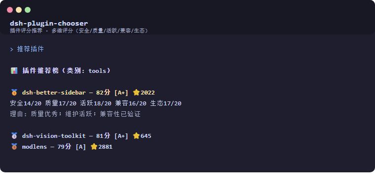

# dsh-plugin-chooser（插件评分选择顾问）

> 📦 仓库地址：https://github.com/SongYuhui14/dsh-plugin-chooser



DeepSeek Harness (DSH) 插件：**解决"插件太多不知道选哪个"的选择瘫痪**。

## 解决什么问题

DSH 插件市场已有 **1,500+ 插件**，同一功能有几十个版本（实测：16 个 OCR、8 个记忆、5 个语音输入）。
用户面对海量重复插件：装哪个？哪个安全？哪个维护活跃？哪个兼容？

**本插件用多维评分给出答案。**

## 评分模型（总分 100）

| 维度 | 满分 | 看什么 |
|---|---|---|
| 🔒 安全分 | 20 | 风险扫描、来源可信度、是否官方、安装脚本/网络外发 |
| ⭐ 质量分 | 20 | star 数、license、描述完整度 |
| 🕐 活跃分 | 20 | 最近提交、版本更新、维护状态 |
| 🔧 兼容分 | 20 | DSH 版本兼容、compat 状态、验证级别 |
| 🌐 生态分 | 20 | 是否精选/官方、社区信任 |

**等级**：A+（≥80）/ A（≥70）/ B（≥60）/ C（≥45）/ D（<45）

## 使用方式

对话中直接说：

- "推荐插件"
- "哪个插件好"
- "tools 类插件排行"
- "推荐一个 OCR 插件"

或输入命令 `/plugin-recommend [category]`。

## 输出示例

```
📊 插件推荐榜（类别: tools）
==================================================
🥇 plugin-xxx — 85分 [A+] ⭐237
   安全18/20 质量16/20 活跃17/20 兼容18/20 生态16/20
   理由: 安全风险低；质量优秀；维护活跃；兼容性已验证

🥈 another-plugin — 72分 [A] ⭐120
   ...
```

## 数据来源

- **市场目录**：读取 `~/.ohdsh/plugin-marketplace/catalog-cache.json`（全部插件 + 元数据）
- **运行时**：回退到 `dynamicCordisRunner.inventory()`

## 开发

```
lib/score.js   — 评分引擎（5 维评分模型 + 排序 + 推荐格式）
lib/index.js   — 插件入口（读取数据 + 注册工具/命令）
```


## 相关作品

- [crypto-evaluation-assistant](https://github.com/SongYuhui14/crypto-evaluation-assistant) — 密评检测辅助
- [ai-security-assistant](https://github.com/SongYuhui14/ai-security-assistant) — AI 安全评估
- [dsh-plugin-conflict-advisor](https://github.com/SongYuhui14/dsh-plugin-conflict-advisor) — 插件冲突顾问
- [dsh-plugin-compat-checker](https://github.com/SongYuhui14/dsh-plugin-compat-checker) — 插件兼容测试
- [dsh-code-vetter](https://github.com/SongYuhui14/dsh-code-vetter) — AI 代码安全审查
- [dsh-publisher](https://github.com/SongYuhui14/dsh-publisher) — 一键发布助手

## 许可

MIT
